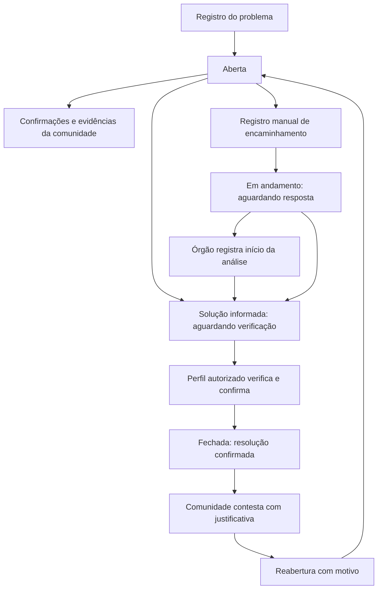

# Fluxo de ocorrências

O morador registra um problema com título, descrição, categoria, importância (baixa, média ou alta), cidade e endereço ou ponto de referência. Fotos e vídeos podem complementar o relato. A ocorrência começa **aberta**, e a comunidade pode confirmar que também observou o problema e adicionar evidências.

Ela passa para **em andamento** quando um encaminhamento manual é registrado pela moderação ou quando uma solução é informada para verificação. O órgão associado pode registrar o início da análise e descrever a ação realizada. O sistema diferencia encaminhamento registrado, análise iniciada e solução aguardando verificação; o registro de um encaminhamento não comprova que o órgão recebeu ou iniciou um serviço.

Informar uma solução não encerra o caso automaticamente. A moderação ou o órgão associado deve confirmar a resolução e explicar como ela foi verificada. Só então a ocorrência aparece como **fechada**. Se o problema persistir ou retornar, a comunidade pode contestar o fechamento e registrar o motivo da reabertura. Datas, responsáveis e justificativas ficam no histórico.

## Regras da implementação

- Confirmações comunitárias não mudam o estado nem aumentam automaticamente a importância.
- O cadastro informa critérios de importância e exige localização que permita encontrar o problema.
- O encaminhamento é somente o registro de uma ação manual por site, telefone, atendimento presencial ou outro canal. Não há envio de e-mail, relatório automático ou integração municipal neste fluxo.
- O protocolo é opcional; a ausência de protocolo não deve ser interpretada como recebimento confirmado.
- Uma solução informada continua em andamento até a verificação. Não existe fechamento automático por prazo.
- As permissões existentes da API foram preservadas: moradores colaboram e contestam; moderadores registram encaminhamentos e verificam soluções; o órgão associado pode registrar análise e verificar soluções. Outros órgãos não recebem essas ações.
- Os três estados visuais agrupam os estados detalhados já usados pela API. Registros antigos com importância crítica são exibidos como alta; novos registros oferecem baixa, média e alta.
- Esta versão fecha apenas como resolvida. Encerramento por duplicidade ou outros motivos exige um contrato específico com o backend e não foi acrescentado.

## Persistência e validação

Ocorrências com identificador da API continuam usando os endpoints existentes do servidor. Alterações só aparecem como concluídas depois da resposta; erros são mostrados na interface. O fluxo local mantém os dados e o histórico no navegador para demonstração e testes. Isso não substitui a persistência e a autorização do servidor para uso entre usuários.

O fluxo foi validado com build e testes automatizados, incluindo o ciclo local completo e as permissões da interface. A execução contra um backend autenticado não foi validada nesta alteração.
