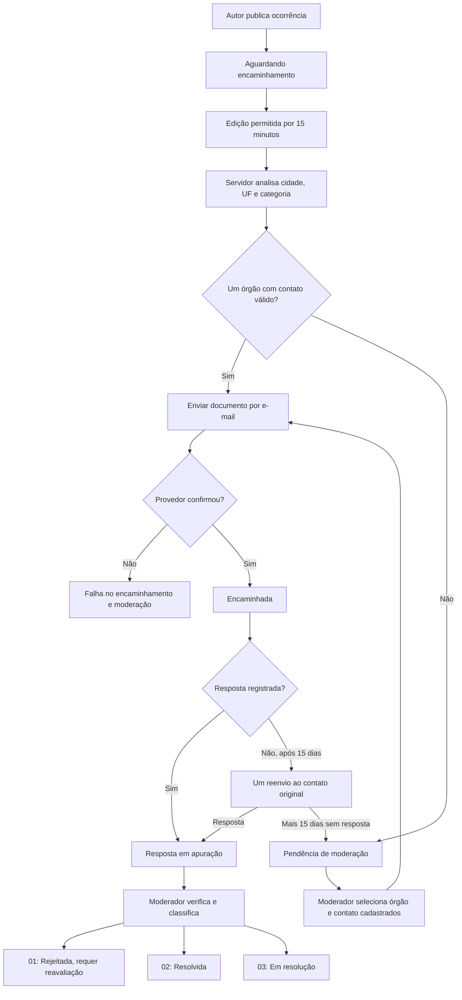
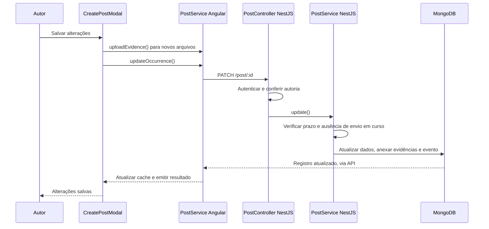

# Mapa técnico do fluxo de ocorrências

Mapeamento do código em 28/09/2026. Este guia cobre o fluxo implementado a partir de `encaminhamento.docx`, sua integração com as telas e os métodos reutilizados. Não é um inventário de todas as funcionalidades do Spectrum.

## 1. Visão geral

O cliente Angular apresenta os dados e envia ações HTTP. O servidor NestJS verifica identidade, permissões e regras de negócio. O MongoDB guarda prazos, status e histórico. O serviço Brevo recebe os e-mails. Fechar o navegador não interrompe os prazos: o processamento depende do servidor em execução.

O segundo período de 15 dias é uma decisão da implementação: o documento não estabelece esse prazo. Uma pendência de moderação é um campo separado do status; não existe um status genérico chamado “Moderação”.

## 2. Arquivos do cliente

Os caminhos desta seção são relativos à raiz de `spectrum-client`.

| Arquivo | Responsabilidade |
| --- | --- |
| `src/app/shared/components/create-post-modal/create-post-modal.ts` | Formulário de criação/edição e upload de evidências. |
| `src/app/core/services/posts/post.service.ts` | Contratos HTTP, conversão da resposta da API e cache local. |
| `src/app/core/services/posts/occurrence-flow.ts` | Agrupamento visual das etapas e rótulos de status. |
| `src/app/features/posts/occurrence-detail-page/occurrence-detail-page.ts` | Carregamento, formulários, permissões visuais e histórico. |
| `src/app/features/posts/occurrence-detail-page/occurrence-detail-page.html` | Estrutura da página, ações por perfil, evidências e linha do tempo. |
| `src/app/features/posts/occurrence-detail-page/occurrence-detail-page.scss` | Aparência, responsividade, foco e uso das cores do tema. |
| `tools/visual-preview.ts` | Prévia com dados fictícios e requisições interceptadas. |
| `tsconfig.visual.json` e `angular.json` | Entrada isolada para a configuração `visual-preview`. |

## 3. Métodos: formulário e serviço HTTP

| Classe / método | O que faz |
| --- | --- |
| `CreatePostModal.publishPost()` | Valida o formulário, prepara evidências e inicia a criação ou edição. |
| `validateForm()` | Retorna a mensagem de validação dos campos. |
| `uploadEvidenceFiles()` | Converte os arquivos selecionados em evidências após upload. |
| `updateExistingOccurrence()` | Encadeia upload e atualização HTTP, trata erro e libera o estado de envio ao terminar. |
| `applyEditingPost()` | Preenche o formulário com os dados existentes. |
| `PostService.createOccurrence()` | Envia a criação à API. |
| `PostService.uploadEvidence()` | Envia arquivo ao endpoint de upload. |
| `PostService.updateOccurrence()` | Faz PATCH com texto, título, descrição, categoria, importância, localização e novas evidências; atualiza o cache após sucesso. |
| `PostService.canModifyPost()` | Verifica autoria e janela de edição para a interface; o servidor também verifica essas regras. |
| `PostService.getOccurrence()` / `getOccurrenceHistory()` | Carregam ocorrência e eventos. |
| `PostService.getRegisteredAgencies()` | Busca o catálogo permitido à moderação. |
| `PostService.forwardOccurrence()` | Solicita envio por e-mail para órgão/contato selecionados. Não simula entrega para um registro local. |
| `PostService.registerForwardingResponse()` | Envia identificador do encaminhamento, resposta, código e protocolo. |
| `PostService.reviewForwardingResponse()` | Envia a classificação do moderador e sua justificativa. |
| `PostService.toSpectrumPost()` / `cacheOccurrence()` | Adaptam o registro da API para a tela e guardam sua cópia. |
| `PostService.assertTransition()` | Impede ações incompatíveis com perfil/status no cliente; não substitui a autorização do servidor. |

`updatePost()` é a edição da cópia local. Para ocorrências persistidas no servidor, o formulário usa `updateOccurrence()`, evitando mostrar como salva uma alteração que não chegou à API.

## 4. Métodos: página de detalhes

| Método / propriedade | Responsabilidade |
| --- | --- |
| `ngOnInit()` / `loadOccurrence()` | Identificam a ocorrência pela rota e carregam seu estado. |
| `loadAgencies()` | Busca órgãos e controla carregamento, erro e nova tentativa. |
| `selectRegisteredAgency()` / `registeredContacts` | Vinculam a seleção do órgão aos e-mails do catálogo. |
| `canEdit`, `canForward`, `canRegisterResponse`, `canResolve` | Determinam quais ações aparecem para usuário, órgão e moderador. |
| `openPanel()` | Abre ou fecha o formulário da ação selecionada. |
| `submitForwarding()` | Confere a seleção de órgão/contato e chama o serviço de envio. |
| `submitResponse()` | Registra a mensagem do órgão sem classificá-la como resolução definitiva. |
| `submitResolve()` | Solicita a revisão com código 01, 02 ou 03. |
| `runAction()` | Centraliza execução, bloqueio de clique repetido, finalização e tratamento de erro. |
| `afterAction()` | Exibe sucesso, atualiza a ocorrência, limpa o formulário e recarrega o histórico. |
| `afterActionError()` | Exibe o erro e consulta novamente a API: uma falha de envio pode já ter sido registrada pelo servidor. |
| `onOccurrenceUpdated()` | Recebe a edição feita no modal compartilhado e atualiza os detalhes. |
| `nextStep` / `moderationLabel` | Traduzem estado e motivo da pendência em orientação ao usuário. |
| `timeline`, `eventDescription()`, `eventActorLine()`, `eventEvidences()` | Organizam os eventos, seu texto, autoria e evidências. |
| `evidenceUrl()` | Só permite URLs HTTP/HTTPS na exibição de evidências. |
| `occurrenceStage()` | Agrupa estados em Aberta, Em andamento e Fechada; somente RESOLVIDA fica Fechada. |

A página reutiliza `SocialShell` para navegação e abertura do modal de edição. As cores usam os tokens do projeto; as regras responsivas adaptam cartões e formulários para celular. Os métodos auxiliares de fluxos antigos continuam no código para compatibilidade; sua existência não significa que haja um botão visível para cada um.

## 5. Sequência de uma edição

Novas evidências são acrescentadas às anteriores. A edição não reinicia o prazo de 15 minutos. O envio usa os dados persistidos mais recentes.

## 6. Endpoints do fluxo

| HTTP | Endpoint | Entrada / finalidade | Regra principal |
| --- | --- | --- | --- |
| POST | `/post` | Criar ocorrência | Usuário autenticado. |
| PATCH | `/post/:id` | Editar dados e acrescentar evidências | Autor, dentro do prazo e sem processamento ativo. |
| GET | `/post/:id` | Consultar ocorrência | Leitura do estado para a tela. |
| GET | `/post/:id/history` | Consultar eventos | Leitura da linha do tempo. |
| GET | `/post/agencies` | Listar catálogo | Moderação. |
| GET | `/post/moderation/pending` | Até 100 pendências mais antigas | Moderação; não há página própria nesta entrega. |
| POST | `/post/:id/agency` | Selecionar órgão cadastrado e acionar envio | Moderação; respeita janela de edição. |
| POST | `/post/:id/forward` | `agency.id`, `agency.email`, `channel: EMAIL` | Moderação; contato deve pertencer ao catálogo. |
| POST | `/post/:id/forward/response` | `forwardingId`, `responseReceived`, `responseCode?`, `protocol?` | Moderação ou órgão relacionado; exige encaminhamento bem-sucedido. |
| POST | `/post/:id/forward/response/review` | `responseCode`, `note` | Moderação; resposta pendente de apuração. |
| POST | `/post/:id/resolve` | Compatibilidade com classificação 02 | Moderação. |

O servidor obtém o ator a partir da autenticação e do cadastro do usuário. Os campos enviados pelo navegador não concedem o papel de moderador.

## 7. Validação e limites

Na conclusão da implementação foram executados 44 testes do cliente e 58 do servidor, além das compilações. Os testes usam simulações de HTTP, MongoDB e provedor de e-mail; não constituem comprovação de entrega real.

- `occurrence-flow.spec.ts`: contratos de edição/resposta e comportamento do fluxo no cliente.
- `occurrence-detail-page.spec.ts`: apresentação e ações conforme perfil/estado.
- No servidor, `forwarding.service.spec.ts`: prazos, seleção, falha, concorrência, reenvio, resposta e revisão.
- No servidor, `post.service.spec.ts`: edição, preservação de evidências e bloqueio por prazo/processamento.
- Revisão visual: desktop, celular e tema escuro; a prévia usa dados fictícios.

Para executar a prévia e o sistema, consulte [Fluxo de ocorrências](fluxo-de-ocorrencias.md). Para o processamento, a persistência e os métodos do servidor, consulte `spectrum-server/docs/mapa-tecnico-encaminhamento.md` no repositório do servidor.

Ainda exigem configuração operacional: MongoDB, credenciais Brevo e catálogo de órgãos reais. A leitura automática de caixa postal, o cadastro de órgãos pela interface e a recuperação de envios incertos não fazem parte desta entrega.
